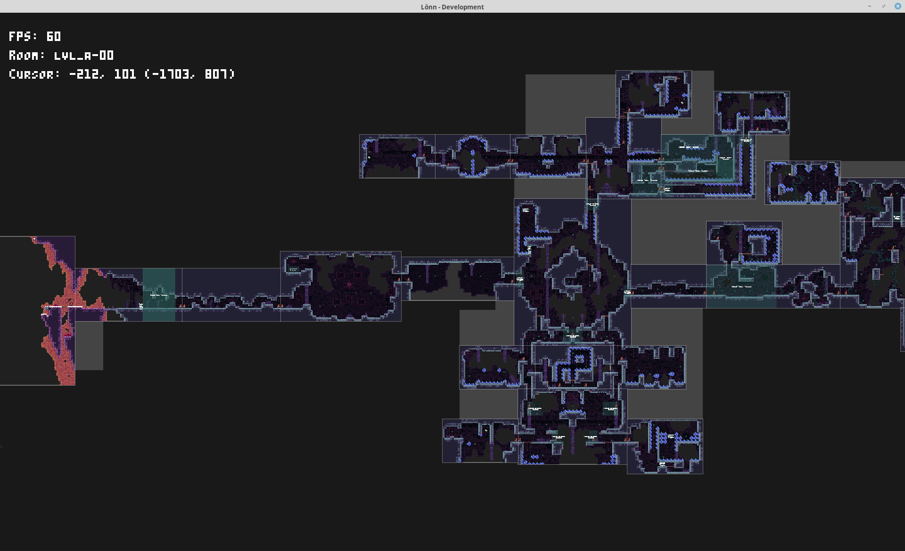
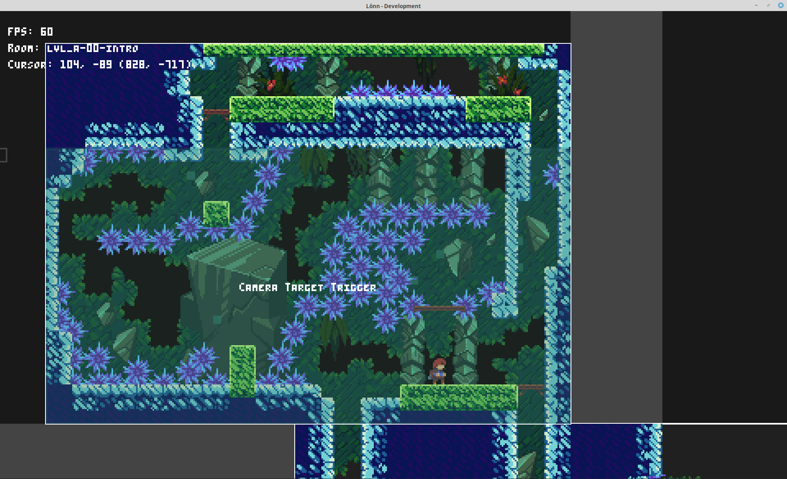

# Lönn

[discord-map-making]: https://discord.gg/Wtjf4Pb "Join #map_making on the 'Mt. Celeste Climbing Association' Discord server"
[ahorn]: https://github.com/CelestialCartographers/Ahorn "The Ahorn Map Editor"
[maple]: https://github.com/CelestialCartographers/Maple "The Maple Map Editing Library"

[][discord-map-making]

[][latest-release]

(we're in `#map_making` on the "Mt. Celeste Climbing Association" Discord server)

---

Lönn is a visual level maker and editor for the game Celeste. It allows editing map binaries, creating new ones, adding rooms, and filling the rooms with anything your heart desires (as long as what your heart desires is possible within the realms of the game).
The generated map binaries can be loaded in the stock game or using [Everest](https://everestapi.github.io/), although the use of Everest is highly recommended. For use without Everest, you can replace a map in `Content/Maps` (remember backups), otherwise, you can place it in `Mods/<yourmodname>/Maps` with Everest and use the custom chapter loading (refer to the [Mod Structure guide](https://github.com/EverestAPI/Resources/wiki/Mod-Structure)).

The program is still in an early state, many things are still missing and it is under active development. If you spot something that is missing, it will most likely be added some time in the near future. If you spot a bug or the program crashes, please report it.

Lönn is a successor to [Ahorn][ahorn], a visual level maker based on [Maple][maple]. If you want to be able to generate and edit maps using code, give Maple a try.

This project is an unofficial map maker and level editor, it is merely a fan project trying to enable map development in the most user-friendly way we can think of. None of this code is developed by or connected to the Celeste development team, but we thank the team for supporting our projects.

## Installation

[latest-release]: https://github.com/CelestialCartographers/Loenn/releases/latest

### Windows

Download the [latest release][latest-release] for Windows and extract the `.zip` file you get into an empty directory. Run `Lönn.exe` to start the program.

### MacOS

Download the [latest release][latest-release] for MacOS and extract the `.zip` file you get into an empty directory (Safari might do this automatically). Launch the extracted `Lönn` app to start the program.

### Other Operating Systems

First, [install love2d](https://love2d.org/). Lönn requires love2d version 11.3 or later; make sure to download love2d from the official website. Also make sure that the `love` command is in your `PATH`.

Download the [latest release][latest-release] for your operating system and extract the `.zip` file you get into an empty directory. Launch `Lönn.sh` to start the program, or run it directly using `love Lönn.love`.

## Usage

The tools in Lönn are shown on the right, just select one to use it.
Hold right click to move around the map. Left click is your main way of placing objects or selecting things. Tools like rectangle placement require holding left click while moving across the screen. Scroll to zoom.

In any menu, you can hover over the name of an option or field for a detailed tooltip explaining its meaning and usage.

Lönn supports a couple of keybinds and special mouse functionality, with more to come. The following list might not be comprehensive. Note that you can change all keybinds in the configuration file.

---

#### General Controls

 - Ctrl + N: New map
 - Ctrl + O: Open map
 - Drag & drop map file into main window: Open map
 - Ctrl + S: Save map
 - Ctrl + Shift + S: Save map as...
 - Ctrl + T: New room
 - Ctrl + Shift + T: Configure current room
 - Alt + Arrow keys: Move room (step size 8)
 - Alt + Delete: Delete room
 - Ctrl + Z: Undo action
 - Ctrl + Shift + Z: Redo action
 - Scroll wheel: Zoom
 - Ctrl + ➕ (plus): Zoom in
 - Ctrl + ➖ (minus): Zoom out
 - F11: Toggle fullscreen

 #### Placements

 - Left click: Place object
 - Holding Ctrl + Left click: Place object (use 1 as step size instead of 8 for more fine-grained control)
 - Right click: Open properties of object under cursor
 - Left click & drag: Adjust size of resizeable objects while placing
 - Middle click: Clone object under cursor
 - Q, E: Shrink / grow width
 - A, D: Shrink / grow height
 - L, R: Rotate supported objects counter-clockwise / clockwise
 - V, H: Flip supported objects vertically / horizontally

 #### Selections

 - Left click: Select object
 - Left click existing selection: Cycle through objects under cursor (smallest to largest)
 - Left click & drag: Select multiple objects
 - Shift + Left click & drag: Add to current selection
 - Ctrl + A: Select all objects
 - Right click selection: Open properties of selected object(s)
 - Holding Left mouse button over selection: Drag selected objects
 - Shift + Holding Left mouse button over selection: Axis-bound object dragging
 - Arrow keys: Move selected objects
 - Q, E: Shrink / grow width on selected objects
 - A, D: Shrink / grow height on selected objects
 - Holding Ctrl + any of the above: use 1 as step size instead of 8 for more fine-grained control
 - L, R: Rotate supported objects counter-clockwise / clockwise
 - V, H: Flip supported objects vertically / horizontally
 - N on entity/trigger: Add starting node to entity/trigger
 - N on node: Add node to entity/trigger after selected node
 - Delete: Delete selected objects
 - Ctrl + C: Copy selection to clipboard
 - Ctrl + X: Cut selection to clipboard
 - Ctrl + V: Paste selection from clipboard

#### Brushes

 - Left click: Place tiles
 - Left click & drag: Drag brush
 - Middle click: Change material to tile under cursor

 #### Debug - For developers

 - F5: Reload entities and triggers
 - F6: Clear rendering cache and redraw map
 - F7: Reload tools
 - Ctrl + F5: Reload everything
 - Ctrl + Shift + F5: Restart Lönn

If you have any question, [**ask us in `#map_making` on Discord**][discord-map-making] so we may add it to this README file. Thanks for being interested in making maps for Celeste!

## Some pictures

Lönn's main window

Close-up of a room

## Frequently Asked Questions

**When will I be able to do [thing you can do in Ahorn]?**

Whenever we add it. Celeste has a lot of things which support for has to be individually added. This takes time, so please be patient. However, if more people complain about the lack of a particular thing, we might add it sooner. For a (currently) more complete set of features, just keep using [Ahorn][ahorn] for now.

**Why do my mods not show up in Lönn?**

Lönn does not support the Ahorn plugins that mods contain. Mod developers will have to add compatible Lönn plugins to their mods separately.

**Why do so many things in the program have weird names?**

Most of these are the names internally used by the game, so blame the devs. Most of them do not have any official names, but we might make the names in Lönn a bit more descriptive later on.

**Is it safe to resave maps from the base Celeste game?**

No. If something is not visible in Lönn, it is still there in data and will be saved along with it. However, the program is currently still unable to save 100% of the original maps back, only about 99%. As always, make backups.

**How to I make room transitions?**

A player is able to move from one room to another if the rooms are directly adjacent and there is at least one spawn point (Player entity) in each room.

**So, I made a map. What now? How do I load it?**

While you can load maps without, it is _highly_ recommended to install [Everest](https://github.com/EverestAPI/Everest). Once Everest is installed, place your map binary in `Mods/<yourmodname>/Maps` in your Celeste installtion directory. It should now be accessible from inside the game.

**Something is broken!**

That's not a question, but please report any bug you find!

## License

The project's source code and assets, other than the exceptions stated below, are developed and licensed under the [MIT license](LICENSE).

The Lönn logo has All Rights Reserved and may only be distributed with original copies of this software. Should you fork the project, do not use the original logo in any way. We would also prefer if you changed the project's name so that it can not be confused with the original.

Lönn contains and uses code from the following projects:
  * [dkjson](https://github.com/LuaDist/dkjson)
  * [lua-yaml](https://github.com/exosite/lua-yaml)
  * [An ffi implementation](https://github.com/sonoro1234/luafilesystem) of [luafilesystem](https://github.com/keplerproject/luafilesystem)
  * [A fork](https://github.com/Vexatos/luajit-request) of [luajit-request](https://github.com/LPGhatguy/luajit-request)
  * [Selene](https://github.com/Vexatos/Selene)
  * [xml2lua](https://github.com/manoelcampos/Xml2Lua)

Lönn also depends on the following projects:
  * [LÖVE](https://love2d.org/)
  * [A fork](https://github.com/Vexatos/nativefiledialog/tree/master/lua) of [lua bindings](https://github.com/Alloyed/nativefiledialog/tree/master/lua) for [nativefiledialog](https://github.com/mlabbe/nativefiledialog)
  * [libcurl](https://curl.se/libcurl/)

Many thanks go to these projects.