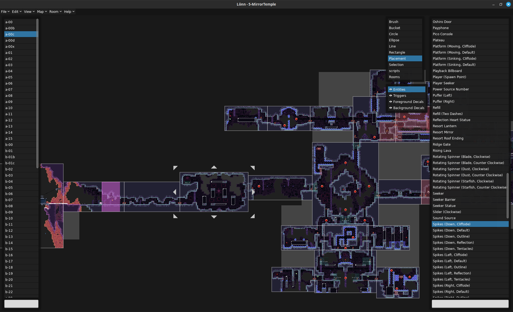
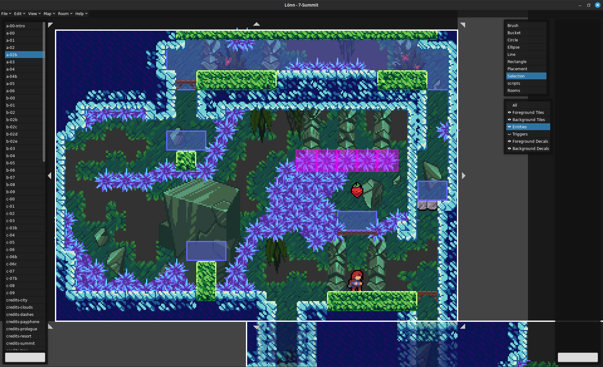

# Lönn

[discord-map-making]: https://discord.gg/Wtjf4Pb "Join #map_making on the 'Mt. Celeste Climbing Association' Discord server"
[ahorn]: https://github.com/CelestialCartographers/Ahorn "The Ahorn Map Editor"
[maple]: https://github.com/CelestialCartographers/Maple "The Maple Map Editing Library"

[][discord-map-making]

[][latest-release]

(we're in `#map_making` on the "Mt. Celeste Climbing Association" Discord server)

---

_Lönn is a visual level maker and editor for the game Celeste. It allows editing map binaries, creating new ones, adding rooms, and filling the rooms with anything your heart desires (as long as what your heart desires is possible within the realms of the game)._

...is what I **would** write here, but this is still an extremely early version of Lönn, and there isn't really any useable map-editing functionality in it yet, although it should come fairly soon. For now, it's just a very fast map viewer. For actually editing maps, continue using [Ahorn][ahorn] for now, but feel free to play around with Lönn!

The program is still in an early state, many things are still missing and it is under active development. If you spot something that is missing, it will most likely be added some time in the near future. If you spot a bug or the program crashes, please report it.

Lönn is a successor to [Ahorn][ahorn], a visual level maker based on [Maple][maple]. If you want to be able to generate and edit maps using code, give Maple a try.

This project is an unofficial map maker and level editor, it is merely a fan project aiming to aid map development until something official is available. None of this code is developed by or connected to the Celeste development team.

## Installation

[latest-release]: https://github.com/CelestialCartographers/Loenn/releases/latest

### Windows

Download the [latest release][latest-release] for Windows and extract the `.zip` file you get into an empty directory. Run `Lönn.exe` to start the program.

### Other Operating Systems

First, [install love2d](https://love2d.org/).

Download the [latest release][latest-release] for your operating system and extract the `.zip` file you get into an empty directory. Launch `Lönn.sh` to start the program, or run it directly using `love Lönn.love`.

## Usage

Lönn supports a couple of keybinds and special mouse functionality, with more to come. The following list might not be comprehensive.
 - Ctrl + Plus: Zoom In
 - Ctrl + Minus: Zoom Out
 - Ctrl + o: Open Map
 - Left click: Main action button for tools
 - Right click: Camera movement
 - Middle click: Clone the hovered item, tool and layer specific

If you have any question, [**ask us on `#map_making` on Discord**][discord-map-making] so we may add it to this README file. Thanks for being interested in making maps for Celeste!

## Some pictures

Lönn's main window

Close-up of a room

## Frequently Asked Questions

**When will I be able to place [entity/decal/trigger/other thing in celeste]?**

Whenever we add it. Celeste has a lot of things which support for has to be individually added. This takes time, so please be patient. However, if more people complain about the lack of a particular thing, we might add it sooner. For a (currently) more complete set of features, consider using [Ahorn][ahorn] for now.

**Why do so many things in the program have weird names?**

Most of these are the names internally used by the game, so blame the devs. Most of them do not have any official names, but we might make the names in Lönn a bit more descriptive later on.

**Is it safe to resave maps from the base Celeste game?**

No. If something is not visible in Lönn, it is still there in data and will be saved along with it. However, the program is currently still unable to save 100% of the original maps back, only about 99%. As always, make backups.

**How to I make room transitions?**

A player is able to move from one room to another if the rooms are directly adjacent and there is at least one spawn point (Player entity) in each room.

**So, I made a map. What now? How do I load it?**

While you can load maps without, it is _highly_ recommended to install [Everest](https://github.com/EverestAPI/Everest). Once Everest is installed, place your map binary in `Mods/<yourmodname>/Maps` in your Celeste installtion directory. It should now be accessible from inside the game.

**Something is broken!**

That's not a question, but please report any bug you find!

**What will you do once the official map maker is out?**

Whenever that happens, we might just continue like before; it might well be that the official editor will not be quite as powerful as Lönn tries to be. It might not ever exist. We'll see.

## Development Tools

To make Lönn easier to develop and make plugins for, it also includes the following keybinds.
 - Ctrl + F5: Reload as much as possible
 - F5: Reload entities and triggers
 - F6: Clear rendering caches
 - F7: Reload tools
 - Ctrl + Shift + J: Start Lua debugging session

Feel free to also ask for development help in the Discord server mentioned above.

## License

The project's source code and assets, other than the exceptions stated below, are developed and licensed under the [MIT license](LICENSE).

The Lönn logo has All Rights Reserved and may only be distributed with original copies of this software. Should you fork the project, do not use the original logo in any way. We would also prefer if you changed the project's name so that it can not be confused with the original.

Lönn contains and uses code from the following projects:
  * [dkjson](https://github.com/LuaDist/dkjson)
  * [lua-yaml](https://github.com/exosite/lua-yaml)
  * [An ffi implementation](https://github.com/spacewander/luafilesystem) of [luafilesystem](https://github.com/keplerproject/luafilesystem)
  * [A fork](https://github.com/Vexatos/luajit-request) of [luajit-request](https://github.com/LPGhatguy/luajit-request)
  * [Selene](https://github.com/Vexatos/Selene)
  * [xml2lua](https://github.com/manoelcampos/Xml2Lua)

Lönn also depends on the following projects:
  * [LÖVE](https://love2d.org/)
  * [A fork](https://github.com/Vexatos/nativefiledialog/tree/master/lua) of [lua bindings](https://github.com/Alloyed/nativefiledialog/tree/master/lua) for [nativefiledialog](https://github.com/mlabbe/nativefiledialog)
  * [lua-https](https://bitbucket.org/bartbes/lua-https)

Many thanks go to these projects.